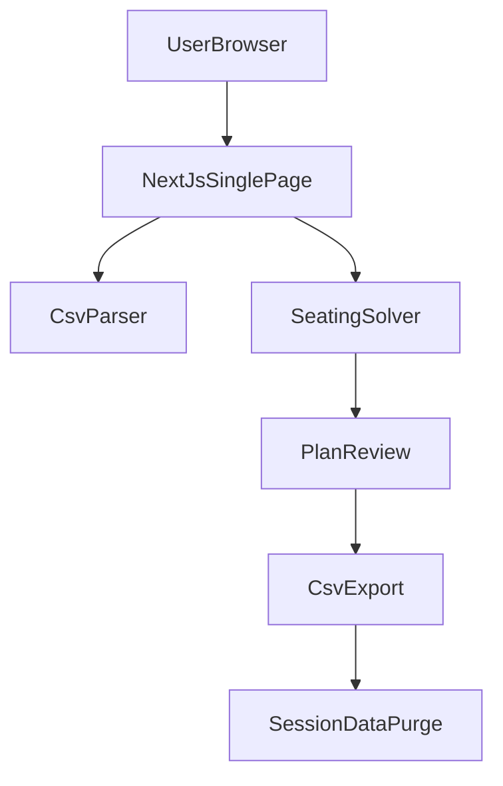

# Seating Planner Web App Plan (Simple MVP)

## Product Scope (Simple MVP)
- No sign-in and no account management.
- Single-page web app where the user can:
  - Upload guest list CSV or type guests manually.
  - Define constraints:
    - Must pair / preferred proximity.
    - Cannot sit together.
  - Define tables and seats per table (uneven capacities).
  - Generate assignments.
  - Retry generation for alternate outcomes.
  - Review final output and download CSV.
- After CSV download, clear all data from app state for privacy.

## Recommended Stack (Free and Simple)
- **App**: Next.js on Vercel free tier.
- **State**: Client-side React state only (no external database).
- **Computation**: Run solver in-browser (or in a local API route only if needed for performance).
- **Rationale**:
  - Zero backend data persistence.
  - Fastest path to MVP.
  - Free hosting and easy deployment.

## High-Level Architecture

## Data Handling Rules
- Keep all inputs and generated plans in client memory during active use.
- Optional: use `sessionStorage` only for page refresh recovery in the same tab/session.
- Never write planner data to a remote database.
- On `Download Final CSV`:
  - Trigger CSV file generation and browser download.
  - Immediately clear in-memory state.
  - Remove any `sessionStorage` keys used by the app.

## MVP Data Shapes (In-Memory)
- `guests`: `[{ id, name }]`
- `constraints`: `[{ type: "must_pair" | "cannot_pair" | "prefer_near", guestAId, guestBId, weight }]`
- `tables`: `[{ id, label, seats }]`
- `generatedPlan`: `[{ guestId, tableId, seatIndex? }]`
- `generationMeta`: `{ seed, score, violations }`

## Solver Strategy (Lightweight Weighted Optimization)
- Pre-checks:
  - Total table seats >= guest count.
  - Constraint references are valid guest IDs.
  - Detect direct contradictions where possible.
- Objective scoring:
  - Strong positive weight for `must_pair`.
  - Strong negative penalty for `cannot_pair`.
  - Medium positive weight for `prefer_near`.
- Search:
  - Generate randomized feasible arrangements.
  - Apply local swaps/moves to improve score.
  - Keep best result within iteration/time limit.
- Retry:
  - Re-run with new random seed.
  - Replace preview with best new candidate.

## UX Flow
- Step 1: Guest input (`CSV import` or `manual add`).
- Step 2: Constraints builder (pairing and cannot-sit rules).
- Step 3: Table builder (count + per-table seats).
- Step 4: Generate and review (score and rule-violation summary).
- Step 5: Finalize and download CSV.
- Step 6: Auto-clear planner state after download.

## CSV I/O
- **Input CSV** (minimum):
  - `name`
- **Output CSV**:
  - `guest_name,table_label,seat_index`
- Include deterministic ordering in export (table label, then seat index).

## Project Structure (Target)
- App route and page shell in [`/app`](./app)
- Seating planner UI components in [`/components/seating`](./components/seating)
- Solver and scoring logic in [`/lib/solver`](./lib/solver)
- CSV parse/export helpers in [`/lib/csv`](./lib/csv)
- Validation schemas in [`/lib/validation`](./lib/validation)

## Testing Focus
- Solver correctness:
  - No table over-capacity.
  - Better score over random baseline.
  - Constraint violations are reported accurately.
- CSV:
  - Robust parse for simple guest-list files.
  - Output format and ordering are correct.
- Session disposal:
  - State cleared after final CSV download action.

## Delivery Phases
1. Build single-page UI skeleton and local state.
2. Add guest input (manual + CSV) and constraint/table forms.
3. Implement generator + retry behavior.
4. Add review screen and final CSV export.
5. Implement disposal-on-download and tests.
